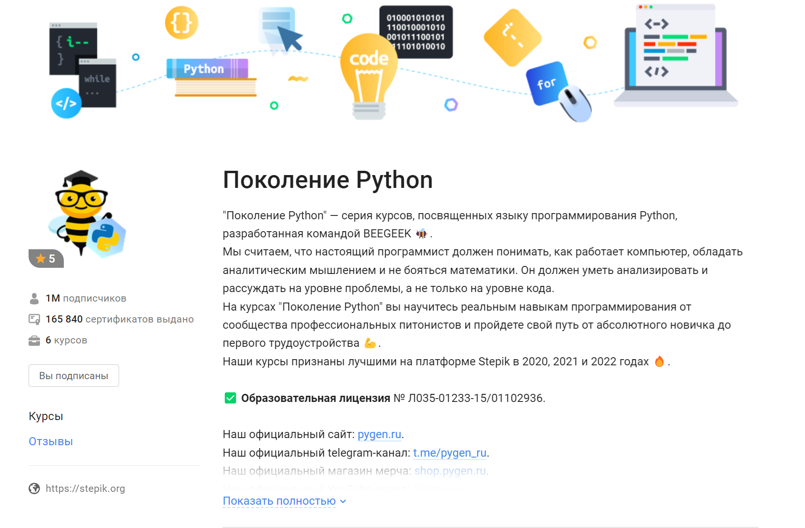

# generation_python
В данном репозитории выложены мои решения домашних заданий из курса 
"Поколение Python" STEPIK всех частей с начинающего до продвинутого. 

Ссылка на курсы: https://stepik.org/org/pygen

